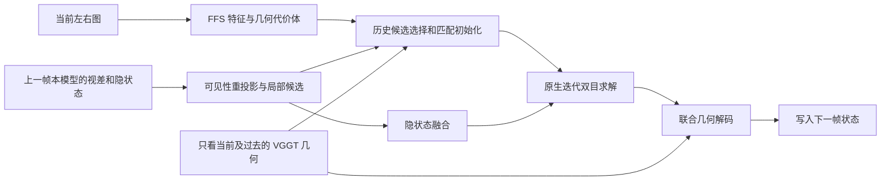

# 原生时序双目求解：结构改动与训练协议

本方案取代此前把 residual_matching_control 作为新版本路线的建议。
已有修正头仅保留为历史基线。用户要求的是求解结构的改变，本轮不使用
v1/修正头权重，也不把 A5 的最终预测作为新模型的输入。

## 改变的信息路径

原结构先独立完成 FFS 双目预测，之后在几何融合中引入历史。历史会经过
相对于当前深度的一致性筛选，最终几何输出又受当前锚点附近的有界更新限制。
新结构将历史移入双目求解之前：



- 历史视差参与匹配位置初始化，能够选择远离当前图像初始解的另一深度模式。
- 当前左右图的特征和代价体重新验证、迭代优化候选，历史不会直接成为最终答案。
- 历史隐状态进入原生迭代过程，当前优化后的隐状态和几何写入下一帧。
- 历史只按几何可见性输送，不按尚可能错误的当前深度提前硬删除。
- 局部候选是特征网格上的 3×3 位置；网格比例为原图的 1/8。
  初始化选择一个候选表面，不平均相距很远的前景与背景视差。
- 历史提供的几何支持会进入联合解码的来源置信度。当前左右一致性不足
  时，已选择且在迭代中保留的历史解仍能参与几何估计。
- 新状态全部来自新模型自身的过去输出；不使用预先算好的 A5 历史答案。

结构参考 [TC-Stereo, ECCV 2024](https://www.ecva.net/papers/eccv_2024/papers_ECCV/papers/04579.pdf)
的“时序补全/状态融合在迭代匹配之前”这一设计。这里复用 FFS 原生代价体
查询与迭代模块，而不是复现完整 TC-Stereo；其视差梯度空间迭代和 RAFT3D
非刚体运动均不在本轮实现范围内。

## 公平的结构对照

三组都从相同 A5 中的 FFS/VGGT 编码器和几何解码器初始化，独立训练。
复用这些权重是共同初始化；新网络不叠加任何旧预测修正头。

| 组别 | 历史进入位置 | 原后置历史融合 | 训练目的 |
|---|---|---|---|
| late | 几何解码阶段 | 开启 | 相同输入和预算的结构控制 |
| early_seed | 双目匹配初始化 | 关闭 | 检验改变匹配落点的作用 |
| early_state | 初始化及迭代隐状态 | 关闭 | 检验状态传播的增量作用 |

原 A5 只在片段末帧提供 VGGT 特征。本轮为每帧计算以该帧结束的独立
因果 VGGT 前缀，三组使用完全相同的输入。另报告零更新诊断：原末帧 VGGT
安排与每帧因果 VGGT 安排，避免把输入更完整的收益归给前置匹配模块。

FFS/VGGT 图像编码器和预训练 FFS 迭代模块在第一轮固定。训练前置匹配
网络、隐状态融合和联合几何解码器；梯度可以经过固定的迭代模块传回
隐状态融合。前置选择另有真实 GT 初始化/接受/拒绝监督。
FFS 迭代器的权重不更新不等于跳过求解：每帧都重新查询代价体，执行
8 次实际迭代，再解码几何。

## 数据、预算和边界

- 使用原缓存计划的 1,152 个训练端点、512×768 图像、8 帧因果片段。
  其中 845 个端点用于训练，307 个来自训练集的独立序列用于开发。
  不采用以前每帧 8,192 个像素的修正头训练格式；本轮训练完整图像。
- 三组各 1,000 次优化，8 GPU、每 GPU 一个片段、seed 42、相同抽样顺序。
  这是固定编码器条件下的结构验证，不宣称等同于 A0–A5 的 6,000 步全骨干训练。
- AdamW；几何解码器 LR 1e-5，新增匹配模块 LR 1e-4；weight decay 0.01，
  梯度范数截断 1；余弦降到初始 LR 的 0.1；固定最终步 checkpoint，无验证集校准。
- 完整 8 帧递推，前 6 帧为无梯度状态预热，末两帧监督；每帧边界显式
  截断历史梯度。使用真实 Spring 左右 GT 的独立 sidecar 补齐末两帧监督，
  不把 endpoint-only 缓存中的历史零占位当成无效 GT。
- 共同损失包含最终视差、GT 时序残差、有效性、相对图像双目预测的大退化
  和不确定性。新模块额外使用候选成功集合、恢复/拒绝、GT 双目匹配与
  困难负样本监督。GT 只进入 loss，时序/双目输入接口不接收 GT。
- 分别评估全部 1,294 个原验证端点。五项指标继续报告，允许组件取舍；
  以 temporal、固定机会恢复、边界/动态分区和退化代价判断结构价值，
  不重新要求五项同时胜出。

## 数值与因果性检查

原生 FFS 求解器在相同批次的编码回放中与原实现逐像素一致。其预训练
权重按原 FSDP 推理的 BF16 形式固定，视差状态保留原生 dtype。逐帧求解
与原打包求解在部分像素存在差异，三组统一使用逐帧求解；不能把它们相对
旧 A5 的全部差值单独归因于时序入口改变。

实际 FFS 已被裁剪，其隐状态是一个 60 通道张量；序列化 args.hidden_dims
仍为旧值。结构尺寸从真实编码张量的 structure.json 读取并记录哈希。

状态预热和有梯度帧使用独立 autocast 缓存边界，防止无梯度预热创建的
参数转换缓存使后续训练丢失卷积参数梯度。反向检查必须验证前置匹配及
隐状态融合的梯度，不能只观察最终 loss 在变化。

还需核对独立过去前缀与完整片段中对应输出一致，以及原始图像输入路径
与缓存路径一致。完成训练、全量评估和这些回执后才形成实验结论。

原始图像入口将 FFS 的图像批次保持为 8 帧形状，短前缀用已知的最早帧
补齐，输出时去掉补齐槽位。FFS 图像分支不跨样本注意；该安排固定数值
内核形状，补齐不使用未来帧。VGGT 始终只接收真实前缀，不做这种补齐。
除扰动未来图像外，还将过去 RGB 物理截断并独立重编码，要求过去输出一致。

## 复现入口

在仓库根目录执行；A5、v1 和原固定采样计划须已存在。原始输入沿用
A0–A5 的标定和相机运动变换，未额外声称只由图像估计相机运动。
新目录用于重建缓存时，不能覆盖本轮已记录哈希的缓存。

```bash
export OMP_NUM_THREADS=1 OPENBLAS_NUM_THREADS=1 MKL_NUM_THREADS=1
torchrun --standalone --nproc_per_node=8 tools/cache_native_temporal_stereo.py \
  --cache /tmp/vggt_temporal_repair_20260907 \
  --output-dir /tmp/vggt_native_stereo_20260907 \
  --config runs/metric_stereo_video/formal_a5_seed42/resolved_config.yaml \
  --checkpoint runs/metric_stereo_video/formal_a5_seed42/checkpoints/step_0006000
python tools/describe_native_stereo_cache.py --cache /tmp/vggt_native_stereo_20260907
torchrun --standalone --nproc_per_node=8 tools/prepare_native_stereo_labels.py \
  --cache /tmp/vggt_native_stereo_20260907 \
  --config runs/metric_stereo_video/formal_a5_seed42/resolved_config.yaml
python tools/run_native_temporal_stereo.py
python tools/finalize_native_temporal_stereo.py
```

`run_native_temporal_stereo.py` 按 late、early_seed、early_state 执行三组，
已有同名运行目录会拒绝混写。`finalize_native_temporal_stereo.py` 等待完整
训练回执，再运行全量评估、最终权重的原图/因果检查、单元测试与报告。
执行中的状态分别记录在本轮运行目录下 `driver_status.json` 和
`finalizer_status.json`。源码快照、权重、逐样本指标和终态回执保存在
`runs/metric_stereo_video/native_temporal_stereo_20260907/`；大缓存位于临时盘。
