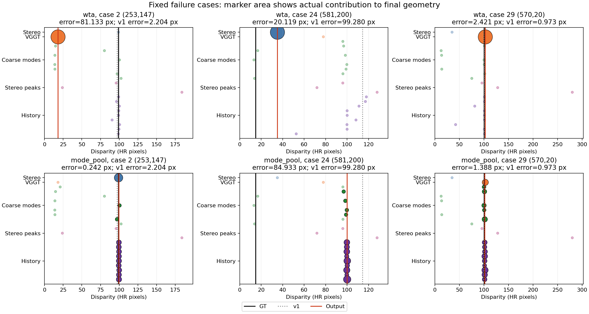

# 设计改动与验收结论

最终形成了一个恢复优先的结构候选 mode_pool。它替换 A5 的几何解码器，前向不使用 A5/v1 最终预测。原始图像入口及独立因果前缀检查通过。v1 保留为基线，未被自动替换。

## 改的是表示和解码

冻结 FFS/VGGT 视觉骨干，保留图像双目、粗匹配模式、VGGT 与本模型自身历史共 23 个候选。新网络为每个 8×8 单元的 64 个像素分别预测分数和偏移；最终按邻近视差聚合表面概率，只在选中中心 ±2 px 内融合。融合候选跨度至多 4 px，避免直接平均相距超过 5 px 的候选，但不能保证选中的表面就是正确表面。

候选表示参考 [NMRF (CVPR 2024)](https://openaccess.thecvf.com/content/CVPR2024/papers/Guan_Neural_Markov_Random_Field_for_Stereo_Matching_CVPR_2024_paper.pdf)；表面概率聚合是基于本轮失败证据提出并训练验证的改动，不是完整 NMRF 复现。

## 实际结果

两组从同一个 memory 2,000 步 checkpoint 出发，各继续训练 2,000 步；网络、数据、监督和预算相同，区别是单标签 WTA 或表面聚合。全部 1,294 个原验证端点已完成。

| 指标 | v1 | 同预算 WTA | mode_pool |
|---|---:|---:|---:|
| 全 GT 惩罚 EPE（cap 10 px）↓ | 0.330162 | 0.363009 | 0.321614 |
| GT 时序残差（cap 10 px）↓ | 0.258275 | 0.336236 | 0.238741 |
| 固定机会恢复率 % ↑ | 35.673887 | 37.887753 | 56.118878 |
| 好像素受损率 % ↓ | 1.548202 | 12.543337 | 10.242793 |
| 相对 A5 的 >5 px 退化率 % ↓ | 0.118310 | 0.183088 | 0.282347 |

EPE/temporal 的无效预测也按原协议惩罚 10 px。上述整体收益指这一既有口径；有效预测区域的未截断 EPE 为 v1 0.444876、mode_pool 0.451717，并未同时改善。

相对同预算 WTA，表面聚合在 EPE、temporal 和恢复率上的配对序列 bootstrap 区间均排除零，支持这一解码设计的增量作用。相对 v1，恢复率提升的区间为 +16.28 至 +25.27 个百分点；temporal 差值区间为 [-0.03769, +0.00227] px，EPE 差值区间为 [-0.01901, +0.00736] px，仍跨零。因此不能宣称已独立确认了对 v1 的整体/temporal 优势。

## 未解决的代价

好像素受损率由 1.548% 升至 10.243%，>5 px 退化率由 0.1183% 升至 0.2823%。相对 v1 新增的大退化为 0.2266%，消除的为 0.0626%；尾部严重度也更高。固定拒绝任务分区的失败率由 26.54% 升至 29.07%。这不是安全性已经解决的版本。

这轮遵循允许取舍的组件评价，不能用三项点估计变好来掩盖上述代价。收益更适合定位为恢复能力和时序建模的结构候选；其他模块能否补偿错误表面选择，仍需实际联合训练验证。

## 固定失败点

| 索引与坐标 | GT | v1 误差 | mode_pool 误差 | 结论 |
|---|---:|---:|---:|---|
| 2 (253,147) | 99.2500 | 2.2036 | 0.2416 | 恢复：原有正确前景候选得到保留 |
| 24 (581,200) | 14.9766 | 99.2804 | 84.9330 | 仍失败：选择了错误的前景表面 |
| 29 (570,20) | 100.3125 | 0.9727 | 1.3884 | 比 WTA 好，但仍不及 v1 |

早期层级追踪发现：一个 99.25 px 的前景 GT 与同粗单元 14.42 px 的中心 GT 并存；另一条正确双目预测约 99.15 px 被固定几何锚点压回约 21 px。这些实证推动了逐像素多候选表示及新解码规则。此前三组前置匹配/隐状态训练、两组平坦候选解码训练均已完整评估，失败结果保留在相邻实验报告中。

## 可复核材料

- [完整指标及配对区间](results.json)
- [逐样本统计](evaluation/per_sample.json.gz)
- [原图、未来扰动与独立前缀检查](raw_checks.json)
- [终态回执](run_summary.json)
- 最终权重（实验机文件：`runs/metric_stereo_video/surface_mode_geometry_20260907/mode_pool/final.pt`；见 [artifact manifest](artifact_manifest.json)）
- [结构与训练协议](../../docs/surface_mode_geometry_protocol.md)

原 A5 的 65 个运行源码文件及 v1 checkpoint 哈希均核验未变。基准已多次用于开发，仅有一个训练种子；本轮不属于独立确认。
