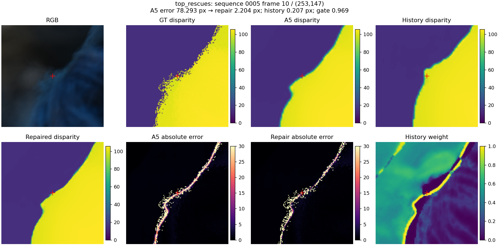
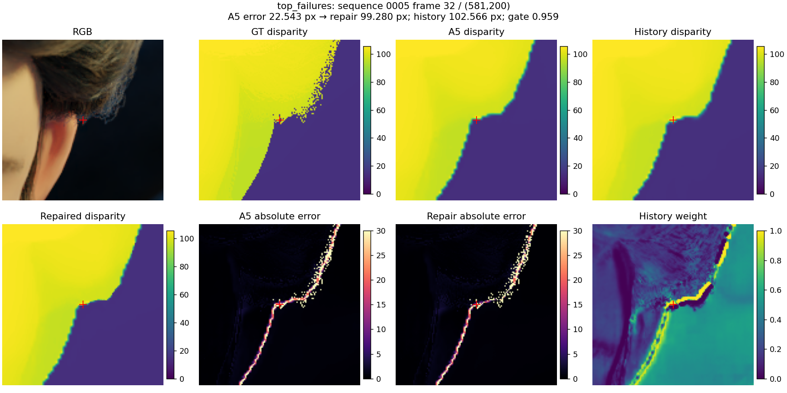

# Temporal failure-case 修复验收，2026-09-07

**结论：A5-HRRepair-v1 通过本次预设验收。** 冻结 formal A5 的 step 6000，追加实际训练完成的 HR 历史选择头后，在完整 1,294 个验证端点上，GT temporal 残差相对 A5 下降 **18.19%**，GT 全域惩罚 EPE 下降 **5.95%**。相对独立训练的无 temporal 对照 A4，这两项分别下降 **19.27%** 和 **7.02%**。

这是冻结 A5 加新头的训练结果。A0–A5 原始权重、配置和结果均保留；本次没有进行新的全模型端到端训练，也没有把运行时开关包装成独立消融。当前系统仍使用 Spring 的已知相机 pose。

## 完整验证结果

所有误差单位为 HR pixel，越低越好。三个模型均使用原 validation split、512×768 fixed crop、T=8 causal endpoint 协议；每个端点只计一次。修复版沿用 A5 的 validity，覆盖率完全相同，均为 **99.8584%**。

| 指标 | A4 独立训练 | A5 独立训练 | A5-HRRepair-v1 | 相对 A5 下降 |
|---|---:|---:|---:|---:|
| GT 全域惩罚 EPE | 0.355078 | 0.351058 | **0.330162** | 5.95% |
| 99% coverage EPE | 0.335686 | 0.334194 | **0.313388** | 6.23% |
| 原始 common-valid EPE | 0.458951 | 0.457294 | **0.444876** | 2.72% |
| GT temporal 残差 | 0.319920 | 0.315694 | **0.258275** | 18.19% |
| 静态 temporal 残差 | 0.266338 | 0.262431 | **0.207013** | 21.12% |
| 动态 temporal 残差 | 0.469249 | 0.464133 | **0.401139** | 13.57% |
| 动态区域惩罚 EPE | 0.433865 | 0.435259 | **0.407294** | 6.42% |
| 细节区域惩罚 EPE | 3.383058 | 3.354905 | **3.075455** | 8.33% |
| 边界区域惩罚 EPE | 1.547774 | 1.541842 | **1.408042** | 8.68% |

“GT 全域惩罚 EPE”对每个 GT-valid 像素计分：有效预测误差上限为 10 px，拒绝或非有限预测计 10 px。common-valid EPE 不截断，仅用于辅助诊断；主结论使用不能通过拒绝困难像素获益的全域指标。99% coverage 使用原协议的 `valid_probability` 排序和 4,096 bins。

修复前后的 temporal 残差都与 GT 的真实 temporal delta 比较。修复版的上一帧也先经过同一修复头，再按其修复后的深度重新投影；没有把修复后的当前帧与未修复的上一帧混用。完整小/中/大相机运动分组见 [metrics.csv](evaluation_v1/metrics.csv)。

数据： [v1 完整指标](evaluation_v1/metrics.json)、[A4 完整指标](a4_full_evaluation/metrics.json)、[逐端点配对结果](evaluation_v1/per_sample.json.gz)。

## 针对“应当成功却失败”的证据

原模型有两个明确的使用限制：历史与当前 base 深度不一致时，历史特征被硬性屏蔽；历史只进入特征融合，最终 LR/HR 深度修正各受 exp(±0.25) 的乘法范围约束。对应代码为 `src/models/metric_stereo_video_geometry.py` 中的 `forward_step`。

原先的 opportunity 报告还存在解释边界：它用独立前缀的 **HR** 历史构造 oracle，而原 A5 实际读取的是 **LR** recurrent state。因此旧报告里的“历史本可更好”不等于原 LR 路径能够直接实现该效果。本次把独立 causal HR 历史真正作为可用候选，所有机会区域均固定由未修复 A5 和该可用候选定义。

新头只读取当前双目匹配残差、历史 RGB 残差、深度差异、置信度、原门控信息和局部深度变化。GT、动态/细节/match 标签不进入推理特征。无有效历史时精确回退到 A5。

- 在“可用 HR 历史比 A5 至少准确 0.1 px”的区域，EPE **1.3987 → 1.0599 px，下降 24.22%**。
- 在其中原门控拒绝历史的区域，EPE **3.5622 → 2.6755 px，下降 24.89%**；**53.66%** 的这些机会像素获得超过 0.1 px 的实际改善。
- 原失败清单中的 sequence 0005 / frame 37 / (570,20)，误差 **65.0462 → 0.9727 px**。见 [原失败点复查](original_failure_points_v1.json)。
- 另一个明确恢复案例：sequence 0005 / frame 10 / (253,147)，原门控拒绝历史，历史误差 0.2068 px；训练后的选择权重为 0.9693，输出误差 **78.2931 → 2.2036 px**。



## 残留失败，不能称为全部修复

仍存在错误历史被高权重采纳的问题，尤其在细边界和毛发区域。上述成功图与下面的失败图使用相同流程选出，完整清单同时保存最大恢复和最大退化。

- sequence 0005 / frame 32 / (581,200)：历史误差 102.5664 px，模型给了 0.9589 的历史权重，导致 **22.5425 → 99.2804 px**。
- 原本 A5 误差小于 0.1 px 的像素中，**1.548%** 被修复头恶化超过 0.1 px。
- 在“历史比 A5 更差超过 0.1 px”的像素子集内，**20.19%** 被恶化超过 0.1 px；该比例不是整个验证集的像素占比。
- 一些原失败点虽然有准确历史，仍只给很小权重，例如 (dataset index 13, x=581, y=11) 仍有约 84.47 px 误差。



这些退化已经计入上表。原始、不截断的 EPE 仍下降 2.72%，但平均收益不能代表每个边界点都得到修复。当前新增路径只有相机 pose 运输，没有加入独立物体非刚性运动估计。

## 实际训练和对照

冻结基座：`runs/metric_stereo_video/formal_a5_seed42/checkpoints/step_0006000`。

新头有 **6,273** 个参数。从原 train split 均匀抽取 1,152 个 endpoint，使用确定的 epoch-zero random crop；其中 24 个序列的 **845** 个 endpoint 用于优化，另 5 个完整训练序列的 **307** 个 endpoint 用于开发和 logit 校准。验证集是另外 8 个序列，三者序列交集均为空。每个训练 endpoint 采 4,096 个均匀像素和 4,096 个历史分歧像素，两组损失总权重为 3:1。

两个版本都实际完成 **3,000 AdamW steps，seed 42**，使用相同数据、初始化和参数量。checkpoint 中 6 组 optimizer state 的 step 均为 3,000。

| 新头版本 | 训练损失 | train 内开发集惩罚 EPE | validation 惩罚 EPE | validation temporal |
|---|---|---:|---:|---:|
| **v1，最终选用** | 30 px 截断的 L1 + 候选选择监督 | 0.524928 | 0.330162 | 0.258275 |
| v2_raw，对照 | 不截断 L1 + 同一候选监督 | 0.528738 | 0.331837 | 0.260906 |

v2 的原始 validation EPE 为 0.442509，略优于 v1 的 0.444876，但主指标和 temporal 较差。最终版本依据 **train 内开发集主指标** 选择，选择记录在读取完整 validation 指标前写入；两个版本的完整结果均保留。取消截断没有解决全部困难点，因此不能把截断认定为唯一失败原因。

见 [训练完成回执](head_v1/training_summary.json)、[完整训练身份](head_v1/training_receipt.json.gz)、[版本选择记录](model_selection.json)、[v2 对照](evaluation_v2_raw/metrics.json)。

## 按序列复核

| validation sequence | 全域惩罚 EPE 下降 | temporal 残差下降 |
|---|---:|---:|
| 0005 | 7.93% | 16.67% |
| 0010 | 4.54% | 15.31% |
| 0015 | 8.33% | 23.15% |
| 0021 | 10.19% | 19.25% |
| 0023 | 0.64% | 4.36% |
| 0030 | 2.60% | 13.80% |
| 0032 | 5.37% | 8.44% |
| 0047 | 3.52% | 26.97% |

8/8 个验证序列的两项指标均改善。按序列 bootstrap 10,000 次、seed 42，95% 收益区间为：全域惩罚 EPE **[0.01209, 0.02899] px**；temporal 残差 **[0.04334, 0.07264] px**。见 [配对统计](evaluation_v1/paired_sequence_analysis.json)。这是单 seed、现有 Spring 验证集的结果；该验证集已用于失败诊断，不是新的盲测数据集。

## 交付和复现

远端工作目录：`/mnt/why/VGGT-Depth`。

最终权重：`runs/metric_stereo_video/temporal_repair_20260907/head_v1/final.pt`

SHA-256：`60fe5a02263c2d39a622e0a0f64db381154c01e01bb33c9dcc21dd295556f269`

本地副本：final.pt（实验机文件：`runs/metric_stereo_video/temporal_repair_20260907/head_v1/final.pt`；见 [artifact manifest](artifact_manifest.json)）。完整回执：[verification_receipt.json](verification_receipt.json)。基础/几何测试合计 **18 passed**；另对 8 个 endpoint、共 3,145,728 个像素从原始图像重新推理，结果与缓存评估 **逐像素差为 0**，validity 也完全一致。见 [在线推理一致性](raw_inference_parity.json)。A5 的 65 个训练时 runtime source 文件全部核对，未发生变化。

```bash
cd /mnt/why/VGGT-Depth

# 重现最终 v1 训练；新目录避免覆盖已验收权重。
CUDA_VISIBLE_DEVICES=0 python tools/train_temporal_candidate_repair.py \
  --cache /tmp/vggt_temporal_repair_20260907 \
  --output-dir runs/metric_stereo_video/temporal_repair_20260907/head_v1_reproduction \
  --steps 3000 --batch-size 32768 --loss-mode capped

# 完整验证，严格沿用正式指标协议。
OMP_NUM_THREADS=4 torchrun --standalone --nproc_per_node=8 \
  tools/eval_temporal_candidate_repair.py \
  --cache /tmp/vggt_temporal_repair_20260907 \
  --checkpoint runs/metric_stereo_video/temporal_repair_20260907/head_v1/final.pt \
  --output-dir runs/metric_stereo_video/temporal_repair_20260907/evaluation_reproduction

# 从原始双目序列运行，不依赖预测缓存。
OMP_NUM_THREADS=4 torchrun --standalone --nproc_per_node=8 \
  tools/infer_temporal_candidate_repair.py \
  --base-config runs/metric_stereo_video/formal_a5_seed42/resolved_config.yaml \
  --base-checkpoint runs/metric_stereo_video/formal_a5_seed42/checkpoints/step_0006000 \
  --repair-checkpoint runs/metric_stereo_video/temporal_repair_20260907/head_v1/final.pt \
  --output-dir runs/metric_stereo_video/temporal_repair_20260907/inference_reproduction \
  --max-batches 1
```

`/tmp/vggt_temporal_repair_20260907` 是临时本地盘缓存。失效后，用 `tools/cache_temporal_candidate_repair.py` 按原 A5 config/checkpoint、`--train-limit 1152 --num-workers 2` 重新生成；输入、checkpoint 和特征源代码摘要保存在 cache lineage 和权重内。最终权重、报告、source snapshot 和回执存放在项目 runs 中。

精确推理实现为当前 T=8 前缀与独立 t-1 前缀各一次 A5 forward，再执行选择头；不能把上一帧修复结果直接反馈替代 A5 历史，也不能把额外前缀计算当作零成本。缓存特征存为 FP16，选择头按 FP32 计算，在线实现使用同样精度路径。
